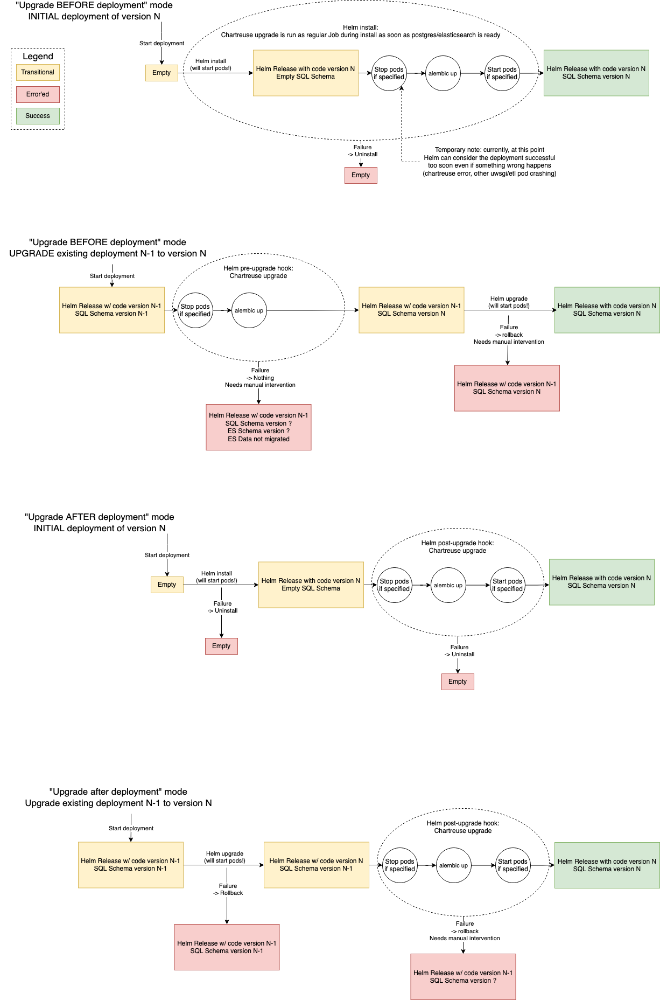

# Chartreuse: Automated Alembic SQL schema migrations within kubernetes

**"How to automate management of Alembic database schema migration at scale using CI/CD and Kubernetes"**

Chartreuse is a wrapper around [Alembic](https://alembic.sqlalchemy.org) to ease,
detect and automate migrations on deployed Python applications.

Chartreuse leverages [Helm Hooks](https://helm.sh/docs/topics/charts_hooks/), the Hooks are defined in [Chartreuse Helm Chart](https://github.com/wiremind/wiremind-helm-charts/tree/main/charts/chartreuse).

## Usage

### Requirements

- Python >= 3.7
- Using Helm to deploy you application
- This Python package requires the `expecteddeploymentscales.wiremind.io` Kubernetes `Custom Resource Definition` from `wiremind-kubernetes` repository:

```bash
kubectl apply -f https://raw.githubusercontent.com/wiremind/wiremind-kubernetes/main/CustomResourceDefinition-expecteddeploymentscales.yaml
```

- Please make sure Chartreuse Python **Package version** and Chartreuse **Helm Chart version**, you use, share `major.minor` otherwise Chartreuse won't start.

## Configuration

### Using Helm

Chartreuse comes with a Helm Chart ready to be used as a Helm Subchart in your own Helm Chart.

All you have to do is build your own container image containing:

- Chartreuse Python package
- Your Alembic migrations in an `alembic` directory
- All required dependencies to run your alembic migrations.

Usually, it will be the same container image for your project with your code as usual, with Chartreuse added as dependency in your setup.py.

and state in the [Chartreuse Helm Chart](https://github.com/wiremind/wiremind-helm-charts/tree/main/charts/chartreuse) values.yaml:

- the image repository and tag
- URL to connect to your PostgreSQL

During install and/or upgrade of your Helm Release, Chartreuse will run as Kubernetes Job and automatically migrate PostgreSQL shchema to `HEAD` if needed.

If required, it will also scale down Deployments that should NOT run during a Deployment using ExpectedDeploymentScale CRD.

Please refer to the [example](example) directory for example.

#### Diagram

The state diagram of your application while upgrading using Helm and using Chartreuse for your migrations is as follows:



## Notes

1. PG clusters managed by postgres-operator (Patroni PG):
    - When Chartreuse starts running against a PG cluster managed by `postgres-operator` (Patroni PG), it may run the migrations before that the cluster is configured, and by configured we mean:
      - the Roles, especially `wiremind_owner_user` and `wiremind_owner` used by Chartreuse and Alembic, are created.
      - The [default privileges](https://www.postgresql.org/docs/12/sql-alterdefaultprivileges.html) are set, so the other Roles, like `wiremind_writer_user` used by the application, can interact with the created objects.
    To ensure that, Chartreuse will not start until `postgres-operator` has performed the above two actions. To make Chartreuse wait, the environment variable `CHARTREUSE_PATRONI_POSTGRESQL` should be set:
      ```yaml
      # in the appropriate Helm values file
      chartreuse-for-a-patroni-pg:
        additionalEnvironmentVariables:
          CHARTREUSE_PATRONI_POSTGRESQL: "anything"
          CHARTREUSE_ALEMBIC_POSTGRES_WAIT_CONFIGURED_TIMEOUT: 100 # It's set to 60s by default
      ```
    - The default privileges above-mentioned are set for the NOLOGIN owner `wiremind_owner`, e.g. tables should be created by `wiremind_owner` so `wiremind_writer[_user]` can insert to them. This is why we need to `SET ROLE wiremind_owner` in the beginning of the transaction before running the migrations, Chartreuse does set `-x patroni_postgresql=yes` to `alembic upgrade head` when the environment variable `PATRONI_POSTGRESQL` is set, you can then retrieve the argument and set the role in your `env.py`:
      ```yaml
      ...
      patroni_postgresql: bool = "patroni_postgresql" in context.get_x_argument(as_dictionary=True)
        ...
        with connectable.connect() as connection:
          ...
          with context.begin_transaction():
            if patroni_postgresql:
              context.execute(text("SET ROLE wiremind_owner"))
            context.run_migrations()
       ...
      ```
2. Chartreuse in pre-upgrade mode:
    - When running Chartreuse in pre-upgrade mode (`upgradeBeforeDeployment: true`), it will not start running (The Chartreuse Pod will hang in `Init` state) until one PG Pod (and ES Pod if ES is used) is running, so make sure these Pods are available to Chartreuse. To fix that:
      - You will need to delete the Chartreuse Job so the upgrade can resume and fix you PG and ES pods (or create them if they don't exist), then you can redeploy so your migrations can run.
      - You can also try the `upgradeBeforeDeployment: false` mode (maybe temporarily).

## Development

### Test

There are three kind of tests:

- Unit tests
- Integration tests: allows to run in a real environment, but still control chartreuse from the inside
- blackbox test: deploy a real Helm Release and test if databases are migrated.

### Documentation

- The diagram has been drawn using the free online software https://draw.io, the
source code is located at `doc/chartreuse_sd.xml`, feel free
to correct it or make it more understandable.
